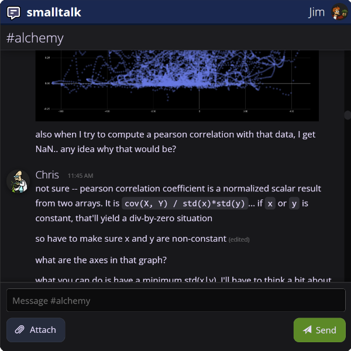

# Smalltalk: A Web Chat Application

Smalltalk is a multi-user, multi-channel web chat application with support for markdown formatting, emojis, images, attachments, and a seamless responsive design across desktop and mobile devices. Created in C#/.NET using Blazor and [Halforbit Data Stores](https://github.com/halforbit/data-stores).

## Features

- **Multi-User and Multi-Channel:** Engage in conversations with multiple users across different channels, ensuring organized and focused discussions.

- **Markdown Formatting:** Express yourself vividly using markdown formatting, including headers, lists, links, and more.

- **Emojis:** Infuse emotions into your messages with a wide range of emojis to choose from.

- **Images and Attachments:** Share images and files effortlessly by attaching them to your messages.

- **Edit and Delete:** Amend your messages or remove them completely.

- **Responsive Design:** Experience the same level of comfort and functionality whether you're on your desktop or using your mobile device.

## License 

Smalltalk is licensed under the MIT License. See the [LICENSE](LICENSE) file for details.
